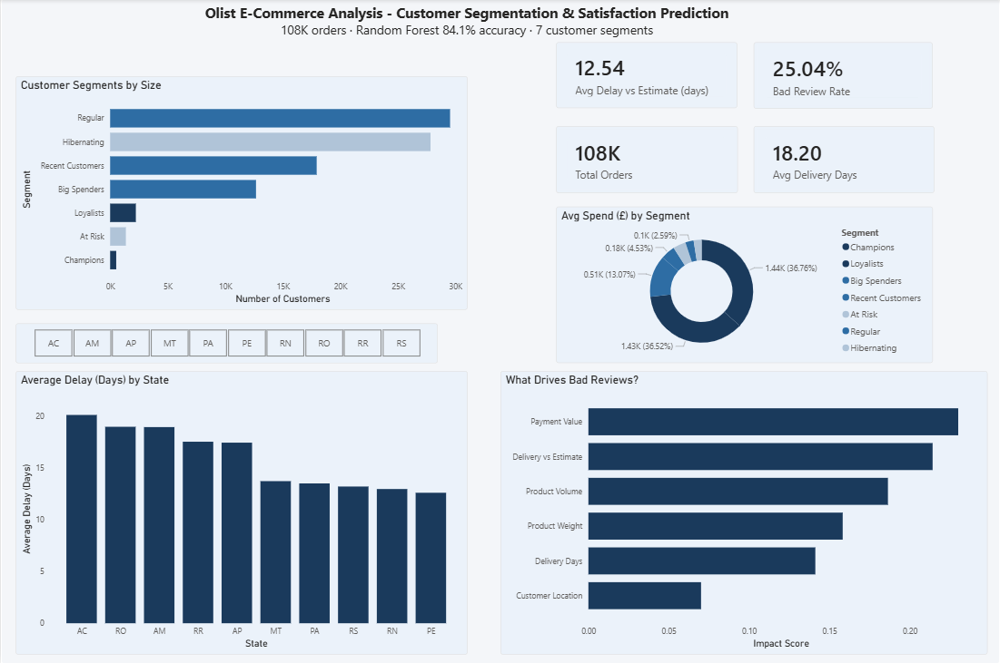

# Olist E-Commerce Analysis
### End-to-End Data Analysis: Customer Segmentation & Satisfaction Prediction

An end-to-end data analysis project using 100,000+ real Brazilian e-commerce orders from Olist. 
The project covers data engineering, customer segmentation, machine learning and business intelligence dashboarding.

---

## Project Summary

| Layer | What was built | Output |
|---|---|---|
| Data Engineering | 9 CSVs ingested into SQLite via SQL | Clean master dataset |
| Customer Segmentation | RFM analysis with 7 segments | Champion to Hibernating classification |
| ML Prediction | Random Forest predicting bad reviews | 84.1% accuracy, F1 0.54 |
| Dashboard | Power BI dashboard with 5 visuals | Interactive business intelligence report |

---

## Key Findings

**1. Delivery accuracy matters more than delivery speed**
The gap between estimated and actual delivery date (`estimated_vs_actual`) is the second strongest 
predictor of bad reviews. Customers react more negatively to missed promises than to slow delivery overall.

**2. Champions and Loyalists drive disproportionate revenue**
Despite representing under 3% of the customer base, Champions and Loyalists account for 73% of 
average spend per customer. The majority segment (Regular) has low monetary value and high recency - 
a retention problem, not an acquisition problem.

**3. Remote states face structural delivery challenges**
States like AC, RO and AM consistently show 18-20 day average delays vs estimate. 
This is a logistics infrastructure issue that directly drives higher bad review rates in those regions.

---

## Tech Stack

- **Python** - data ingestion, feature engineering, machine learning
- **SQLite** - relational database storing all 9 Olist tables
- **SQL** - complex joins across 5 tables, subqueries, aggregations
- **Pandas** - data cleaning, RFM calculation, feature engineering
- **Scikit-learn** - Logistic Regression and Random Forest classification
- **Power BI** - interactive dashboard with KPIs, segmentation and driver analysis

---

## Project Structure
```
Olist_Project/
│
├── data/                          # Raw CSV files (9 Olist tables)
├── Olist_Analysis.ipynb           # Main notebook — all phases
├── olist.db                       # SQLite database
├── state_delivery.csv             # Aggregated delivery data by state
├── rfm_segments.csv               # RFM segment summary
├── feature_importance.csv         # ML feature importance scores
├── Olist_Dashboard.pbix           # Power BI dashboard file
└── dashboard_screenshot.png       # Dashboard preview
```

---

## Phases

### Phase 1 — Data Engineering & SQL Architecture
- Loaded all 9 CSV files into a SQLite database
- Wrote a complex SQL query joining 5 tables: orders, customers, payments, order items, products
- Used a subquery to aggregate payments to one row per order, resolving duplication
- Filtered to delivered orders only with non-null delivery dates

### Phase 2 — Feature Engineering & RFM Segmentation
- Engineered three new features: `delivery_days`, `estimated_vs_actual`, `product_volume_cm3`
- Calculated Recency, Frequency, and Monetary values per customer
- Used custom bins for Frequency scoring to handle data skew
- Segmented 92,000+ customers into 7 groups: Champions, Loyalists, Big Spenders, Recent Customers, Regular, At Risk, Hibernating

### Phase 3 — Machine Learning: Satisfaction Prediction
- Target variable: `is_bad_review` - 1 if review score below 4, else 0
- Bad review rate: 23.2% across 108,000 orders
- Baseline: Logistic Regression - 79.1% accuracy, F1 0.25
- Advanced: Random Forest - 84.1% accuracy, F1 0.54
- Key insight: Payment value and delivery vs estimate gap are the top two predictors

### Phase 4 — Power BI Dashboard
- 4 KPI cards: Total Orders, Avg Delivery Days, Avg Delay vs Estimate, Bad Review Rate
- Customer Segments bar chart with winner/loser colour coding
- Avg Spend by Segment donut chart - shows spend concentration among small segments
- Average Delivery Delay by State bar chart with state slicer
- What Drives Bad Reviews - feature importance horizontal bar chart

---

## Dashboard Preview



---

## How to Run

1. Clone the repo
2. Install dependencies
```
pip install pandas scikit-learn matplotlib seaborn sqlalchemy jupyter
```
3. Open the notebook
```
jupyter notebook Olist_Analysis.ipynb
```
4. Run all cells in order
5. Open `Olist_Dashboard.pbix` in Power BI Desktop

---

## Dataset

Olist Brazilian E-Commerce Public Dataset — available on Kaggle.
100,000 orders from 2016 to 2018 across multiple Brazilian marketplaces.
```

Save it then push:
```
cd Desktop/Olist_Project
git add .
git commit -m "FINISH: Add README, dashboard screenshot and final exports"
git push origin main
